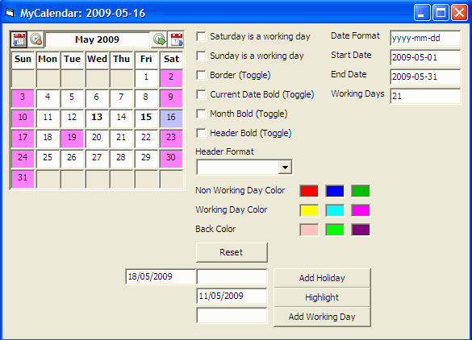

## MyCalendar

### Description

A resizable calendar control that returns day clicked, year selected and month selected. It can return the number of working days within the selected month including the start and end dates of the month selected. You can also define the output date format e.g yyyy-mm-dd or any date format you want. You can also highlight saturday and sunday as working days or non-working days, add holidays to it so that they get marked as non-working days. You can even mark particular days as working days within days that fall during weekends where such weekends are non-working days. This also has the functionality of highlighting in bold any date that you specify. Enjoy and please vote if you like.
 
### More Info
 
Calendar activex control

             |
---                |---
**Submitted On**   |2009-04-26 23:38:48
**By**             |[Anele Mbanga](https://github.com/Planet-Source-Code/PSCIndex/blob/master/ByAuthor/anele-mbanga.md)
**Level**          |Advanced
**User Rating**    |5.0 (10 globes from 2 users)
**Compatibility**  |VB 6\.0
**Category**       |[Custom Controls/ Forms/  Menus](https://github.com/Planet-Source-Code/PSCIndex/blob/master/ByCategory/custom-controls-forms-menus__1-4.md)
**World**          |[Visual Basic](https://github.com/Planet-Source-Code/PSCIndex/blob/master/ByWorld/visual-basic.md)
**Archive File**   |[MyCalendar2152455152009\.zip](https://github.com/Planet-Source-Code/anele-mbanga-mycalendar__1-72038/archive/master.zip)

